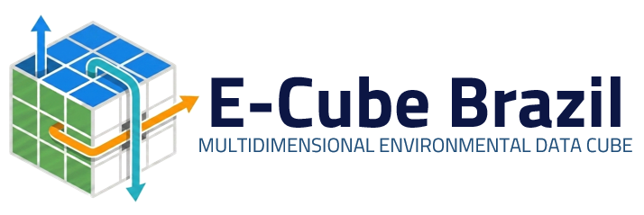

<p align="center">
  
</p>

E-Cube Brasil is a Python framework for spatio-temporal land use analysis. It generates cellular space grids, computes zonal raster/vector metrics, exports 3D topology, builds NetCDF datacubes, and auto-generates STAC catalogs with datacube extensions for environmental modeling and scenario simulation.

## API

API for generating spatiotemporal grid cells, processing zonal metrics (vector/raster), and exporting NetCDF cubes and STAC catalogs.

### 🚀 How to Install

git clone [https://github.com/labmi-inpe/e-cube-brazil.git](https://github.com/labmi-inpe/e-cube-brazil.git)
cd e-cube-brazil
pip install -r requirements.txt

### 🛠️ Pipeline Execution

1. Generate Cellular Grid and GPKGs
python scripts/main.py scripts/config.yaml

2. Build NetCDF Data Cubes
python scripts/run_conversion.py

3. Generate STAC Catalog
python scripts/build_stac_catalog.py

#### Code Import Adjustments
When renaming the package folder or organizing scripts inside the scripts/ directory, update the import statements at the beginning of your scripts (such as main.py and run_conversion.py):

In scripts/main.py
from cellular_space import CellularSpacePy, generate_cellularspace_terrame_like
from raster_metrics import apply_raster_metrics
from vector_metrics import apply_vector_metrics

In scripts/run_conversion.py
from gpkg_to_netcdf import build_netcdf_cube_from_annual_gpkgs

### 📁 Data Download

Due to GitHub's file size limits, the input datasets (`dados/` directory) are hosted externally on Dropbox. 

Before running the execution scripts, download the dataset from the link below and extract it into the root directory of this repository:

👉 **[Download E-Cube Brazil Datasets (Dropbox)](https://www.dropbox.com/scl/fo/vz9argol8aa0m1gtq8ipd/ACNDkD1GLOFWUf8wyIUsb0M?rlkey=3omzwlzw3oxifdbra0cptonv1&st=g6vjtepa&dl=0)**

After downloading, ensure your directory structure looks like this:

```text
e-cube-brazil/
├── dados/
│   ├── limite_biomas_ibge_epsg_5880.shp
│   ├── land_use_ibge_2015_epsg_5880.tif
│   └── ...
├── scripts/
└── config.yaml
